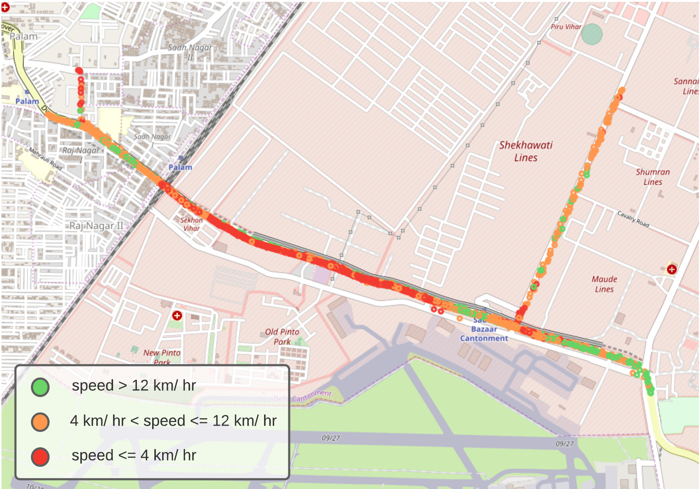

# Bus-Breakdown-Detection-Using-Real-Time-Transit-Data

repository for breakdown detection

## Execting the real-time cluster detection module
Refer to this [README](cluster_cases/README.md) file

##TO-DO
- [x] code for real-time cluster detection
- [ ] code for cluster detection from stored databases
- [x] code for dataloss case detection from stored databases
- [ ] code for real-time dataloss case detection